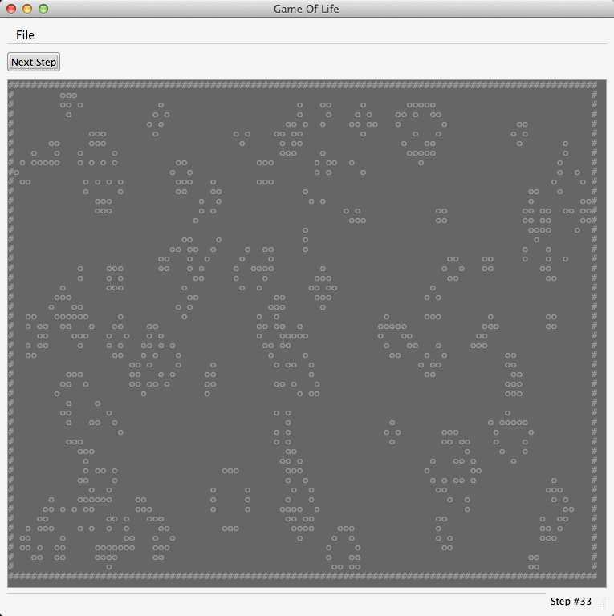

Game Of Life (csLife)
======

A C# implementation of Conway's Game Of Life in Mono and with GTK#

This is a simple implementation, where the aim was to build a framework that would later be easily expanded.
In this version, the Life grid is displayed in a TextView.

Options to add in future:
- Add custom patterns
- Populate the grid using patterns

